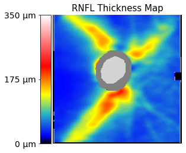
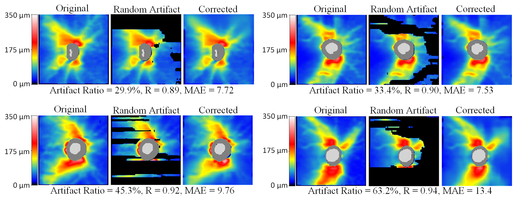

# EyeLearn
Paper: Artifact-Tolerant Clustering-Guided Contrastive Embedding Learning for Ophthalmic Images


## Requirements
Python 3.8 <br/>
tensorflow 2.4.0 <br/>
opencv-python 4.5.5

## Dataset
The glaucoma data includes 500 OCT RNFLT maps (dimension 225x225). The glaucoma label and visual field mean deviation (md) information are also included in the data.

Here are sample codes to visualize the rnflt map:
````
from utils.map_handler import *

rnflts = np.load('dataset/rnflt_map500.npy')
plot_2dmap(maps_all[0], show_cup=True)
````


## Pretrained Model
EyeLearn_weights.72-0.0019.h5 [BaiduDisk](https://pan.baidu.com/s/1cX8t3OHLCpVb7HI0AumQqA?pwd=xqbt)


## Use the Pretrained Model
````
from models import rnflt2vec

# load the pretrained model
eyelearn = rnflt2vec.construct_model_from_args(args)
model.load('EyeLearn_weights.72-0.0019.h5', train_bn=False, lr=0.00005)

# embedding learning model
encoder = eyelearn.model.get_layer('embed_model')
model_embed = Model(inputs=encoder.inputs, 
                    outputs=encoder.get_layer('encoder_output').output)
                    
# artifact correction model                   
model_correction = Model(inputs=[eyelearn.model.inputs[0], eyelearn.model.inputs[1]],
                                 outputs=eyelearn.model.output[0])
                                 
embeds = model_embed.predict([masked_maps, masks]) # embedding inference
preds = model_inpaint.predict([masked_maps, masks]) $ artifact imputation
````

Artifact imputation samples: <br />


## Citation
Shi, M., Lokhande, A., Fazli, M.S., Sharma, V., Tian, Y., Luo, Y., Pasquale, L.R., Elze, T., Boland, M.V., Zebardast, N. and Friedman, D.S., 2022. Artifact-Tolerant Clustering-Guided Contrastive Embedding Learning for Ophthalmic Images. arXiv preprint arXiv:2209.00773.
