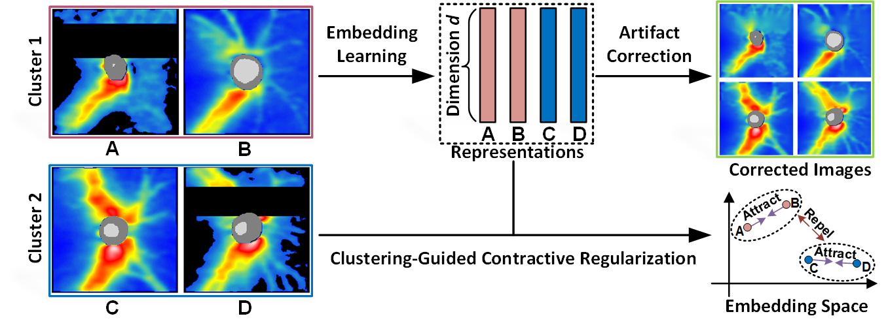

# EyeLearn
Paper: Artifact-Tolerant Clustering-Guided Contrastive Embedding Learning for Ophthalmic Images

## Requirements
Python 3.8  
tensorflow-gpu 2.4.0  
opencv-python 4.5.5

## Pretrained Model
EyeLearn_weights.72-0.0019.h5 [BaiduDisk](https://pan.baidu.com/s/1cX8t3OHLCpVb7HI0AumQqA?pwd=xqbt)

## Citation
